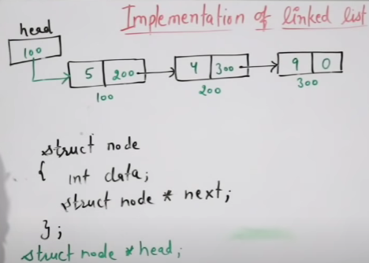
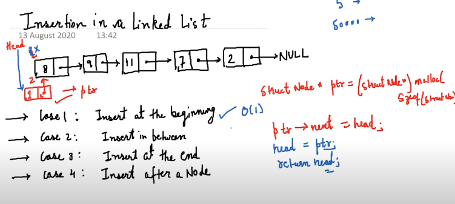
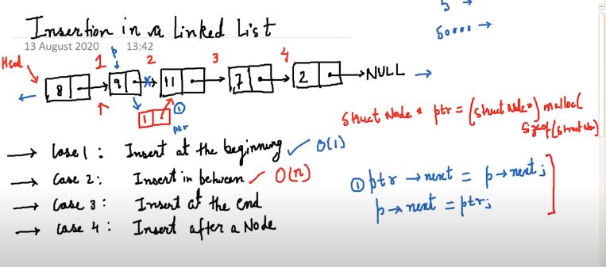
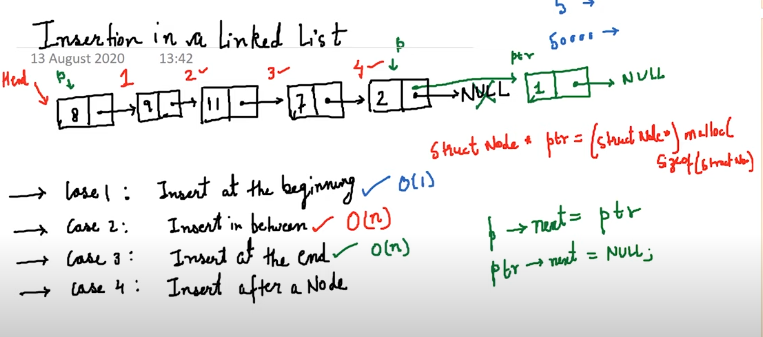
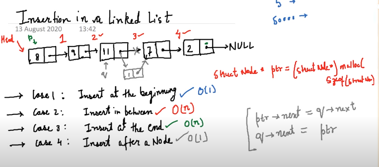

# NOTES random

## linked list from Jenny's lectures

linked list is a list of nodes that contain two parts of data inside it, namely the data and the address of the next node. The last node has a NULL value in the address part. The first node is called the head node. The last node is called the tail node.

we are considering the following linked list structure



Here we are creating a structure of the nodes of the linked list. Firstly we'll use `struct` to create the type of data it'll have(here int and an address) and then since it'll also contain the data of the next node which is a `struct` so we'll use the same `struct` type inside the original struct to create the node named `next` using a pointer which points to it so as to make that "link"ed list. In this way this linked list structure is created and it goes circle on and on like that recursion.

We also need to create one separately for the head and it'll be defined as null from the starting since it is not supposed to have something in it. It just points to the first node. We have used the struct type here as well because we write the data type of that variable whose address that pointer is going to store.

The memory is still not allocated for the linked list. We'll do that using the `malloc` function in C.

```c
struct node{
    int data;
    struct node *next;
}
struct node *head = NULL, *newnode;

head = (struct node*)malloc(sizeof(struct node));
```

Now to allocate memory we'll need to use the malloc function which is used to dynamically allocate memory in C. It is an inbuilt function which will take in the size which we want to allocate so we'll use the following syntax: `malloc(sizeof(struct node));`.

Data type is struct node which has int which is of size 4 bytes and one is pointer so 4 bytes is to be allocated, so all in all it is 8 bytes of complete block will be allocated.

The malloc function returns a void pointer. And also it will have an address so we'll use a pointer variable to store this. So we'll create another pointer variable `*newnode`, and we'll use this pointer variable whenever we want to create a new node.

Now we'll also have typecast the malloc function to the struct node pointer type. So we'll write `newnode = (struct node*)malloc(sizeof(struct node));`, because we are dealing with a pointer to a node.

And for the data part we can take inputs or we can give it directly. So we'll use `newnode` to access and insert data there since that is why we have created a `newnode` pointer variable. Syntax goes like this: `scanf("%d", &pointer_variable -> structure_data_name);`, i.e `scanf("%d", &newnode->data);`. We can also use the dot operator way, but this arrow way is easy to use

And to end the node, we'll use `pointer_var -> node_var = 0;` `newnode -> next = 0;` to access the address, so we have taken `newnode` as the pointer var and `next` for the address of next node so we can do that using pointer as well.

Now we also have to link the nodes to form a LL. Firstly we'll make the head point to the first node. So we'll need to store the address of the first node in the head so we'll simply do: `head = newnode;` and the head will point to the first node.

There may be cases when `head == NULL`, then we'll keep a if to check for that since we cannot point the head to the new memory address otherwise the previous one will lose its link and the new one will take its place. Else we'll do the next steps in the else part i.e we will be creating more nodes, the `newnode` will have the new addresses and so we'll connect the first one(prev) to the second one using the syntax `head -> next = newnode`

# linked list from CWH

## 14- Linked List creation and traversal

for context `head` is a struct pointer. To get the data of a struct we can use arrow operator to do so. `head -> data` will give us the data of the head node.

to link a second node to the first node we can use the arrow operator to access the next node of the first node and then assign the address of the second node to it. `head -> next = secondNode;`

## 15- Linked List insertion

Let us consider a linked list with some nodes: head -> first node(1) -> second node(2) -> third node(3) -> fourth node(4) -> fifth node(null)

### Case 1 - Insert at the beginning

Now the head node points to the first node and also we have a `new node (100)` which has just been introduced. Now to make the new node the first node we'll have to make the following steps:

1. join the new node to the first node, i.e ptr -> next = head, it'll point to the node where head is pointing to.
2. Then we'll remove head from the first node and point it to the new node.
3. Then we'll get the new node inserted at the beginning.

### Case 2 - Insert in between

Now to insert a new node in between, let's say in between 1 and 2, we'll have to do the following steps:

1. Firstly create a function for doing that operation
2. P ptr is what is going in the LL
3. Then we'll create a new node 'ptr', which'll have some data and then we'll make it point it to the second node. i.e
   1. `ptr -> next = p -> next;` // This adds the next upcoming node's address i.e 2 to the new node i.e ptr so as to make the link in bewtween.
   2. `p -> next = ptr;` // And then this replaces the node 2's address that is to be stored in 1's next link with the new node ptr's address so as to make that link permanent ultimately inserting the new node 'ptr' between 1 and 2.
   3. note: Before doing this, it'll have two pointers one that traverses on the LL already and one for making the change in between
4. Complexity: It'll be O(n) in the worst case like when it'll be behind somewhere so we'll have to go through the list everytime till we reach that and in the best case which will be getting that in the first place, it'll be always constant i.e O(1).

.png>)

### Case 3 - Insert at the end

Here we are still following the same LL. So we will continue traversing in the LL using a pointer `p` which will go on till it is not NULL. Then we'll create a new node named `ptr` and continue traversing until p.next == null, then we'll write the following statements:

1. `p -> next = ptr;`
2. `ptr -> next = null;`

By doing the above we can insert at the end when the main pointer `p` reaches NULL. It's worst case complexity is O(n).

### Case 4 - Insert after a certain node

Using the same LL, let's assume we have a given pointer `q` which is of some node from the LL and we have a new node `ptr` that is to be inserted after `q`. Now we'll do the same traversal from the first till it reaches `q` then we'll do the following steps:

(mene khud kiya lol)

1. `ptr -> next = q -> next`
2. `q -> next = ptr`

Complexity: The pointer is given to us so we'll not have to traverse unnecessarily till it reaches its destination. So as such its time complexity will be O(1) which means constant time complexity

## 16- Coding the 15th Linked List insertion video in C

1. **Insert at first:** We'll use the following function to make this happen. Firstly we'll do all the normal steps and then at the last we'll pass the head (struct node pointer) to the function `insertAtFirst` which then takes that pointer and makes it second by introducing another new struct node pointer `ptr` by making its next point to the head and then adding data to it as well.

```c
struct node *insertAtFirst(struct node *head, int data) {
  struct node *ptr = (struct node *)malloc(sizeof(struct node));
  ptr->data = data;
  ptr->next = head;
  return ptr;
};
```



2. **Insert at between:** Here we'll be doing something different. Firstly we'll do the create a function that will take the arguments as head pointer, the data and an index. Then we are going to recreate and allocate memory to a new pointer `ptr` that'll be added to the place between let's say between 2 and 3. And we'll also create a new `p` pointer that will work instead of head from the same address as head. Then in the while loop we are going to iterate from the `i = 0` till `index - 1` in which p will iterate through them and will go till it reaches the required index i.e 2 after which the p is to be added (how the iteration happens: i is 0 firstly but it'll iterate till `i = index -1` which means that go till before the main point so as to make the changes and make p point to that as well `p = p -> next`, so for 0 the condition fulfills so p pointing to the head now changes to node 1, and for the next iteration it exits out of the loop since that'll be false). Now for the new node `ptr` part, it'll take the data first, then point to the next of p i.e the node 2 so as to put the new node in the middle of 1 and 2. Now the last second line `p->next = ptr;` breaks the link from node 1 - 2 (prev pointing to 1) and now connects node 1 to new node ptr and at the every last returns head.

Do note that it'll not work for index = 0.

```c
Node *insertAtIndex(Node *head, int data, int index) {
  Node *ptr = (Node *)malloc(sizeof(Node));
  Node *p = head;

  int i = 0; // 0 1
  while (i != (index - 1)) { // index = 1 all the times.
    p = p->next; // p is pointing to 1 node
    i++;
  }
  ptr->data = data;
  ptr->next = p->next; // ptr points to 2 now
  p->next = ptr; // p pointing to 1 now connects node 1 to new node ptr
  return head; //returns head normally after using it.
};
```



3. **Insert at end**: This is simple, this will go from the first node till the end node till it becomes NULL, then we'll just need to make the last node point to the new one that is to be inserted and make the new inserted node point to NULL, and as such the new node will be inserted at the end.

```c
Node *insertAtEnd(Node *head, int data) {
  Node *ptr = (Node *)malloc(sizeof(Node));
  Node *p = head;
  ptr->data = data;
  while (p->next != NULL) {
    p = p->next;
  }
  p->next = ptr;
  ptr->next = NULL;
  return head;
};
```



4. **Insert after a node**: This one is simple as well. Firstly we'll have to make a new pointer for creating a node. Now we have the `ptr` pointer which is required to be added after a certain node, so we'll take that node in the function params, then also take the head. Then we'll give the data to the new pointer, make the `ptr`'s next point to `prevNode`'s next since that is to be connected to it and connect the `prevNode` to `ptr` by pointing its next to the new `ptr` node.

```c
Node *insertAfterNode(Node *head, Node *prevNode, int data) {
  Node *ptr = (Node *)malloc(sizeof(Node));
  ptr->data = data;
  ptr->next = prevNode->next;
  prevNode->next = ptr;

  return head;
};
```


